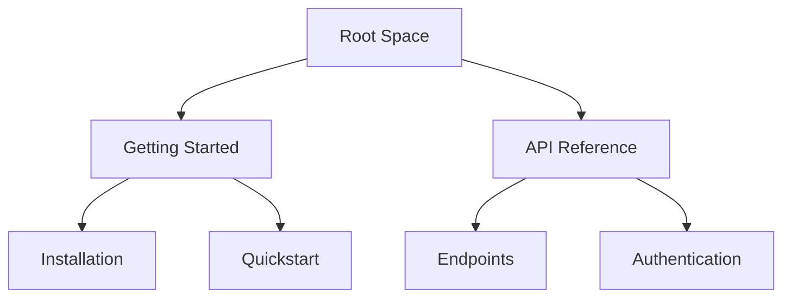

## Overview

Messi provides powerful tools to streamline your documentation workflow. You organize content into intuitive hierarchies, collaborate in real-time with teams, track every change through version history, and quickly find information with advanced search and filtering. These features ensure your docs stay current and accessible.

<Columns cols={2}>
  <Card title="Document Hierarchies" icon="layers" href="#document-structuring">
    Build nested structures for complex projects.
  </Card>
  <Card title="Real-time Collaboration" icon="users" href="#collaboration">
    Edit simultaneously with live updates.
  </Card>
  <Card title="Version History" icon="git-branch" href="#version-history">
    Revert changes and audit trails effortlessly.
  </Card>
  <Card title="Search & Filtering" icon="search" href="#search">
    Find content across your entire docs space.
  </Card>
</Columns>

## Document Structuring and Hierarchies

Create organized documentation spaces with nested pages and sections. You define hierarchies using folders and subpages, making navigation intuitive for users.

<Steps>
  <Step title="Create a Space" icon="folder">
    Start a new documentation space for your project.
  </Step>
  <Step title="Add Nested Pages" icon="file-text">
    Drag and drop pages to build your structure.
  </Step>
  <Step title="Publish Hierarchy" icon="globe">
    Generate a navigable sidebar automatically.
  </Step>
</Steps>



This flowchart shows a typical hierarchy. Customize depths to fit your needs.

<Callout kind="tip">
  Use frontmatter in MDX files to set custom titles and descriptions for better SEO.
</Callout>

## Real-time Collaboration Editing

Invite team members to edit docs simultaneously. Changes appear instantly, with cursors showing who edits what.

<Tabs>
  <Tab title="Web Editor" icon="globe">
    Access via `https://dashboard.example.com/docs/your-space` for browser-based editing.
  </Tab>
  <Tab title="Desktop App" icon="monitor">
    Download the app for offline edits that sync on reconnect.
  </Tab>
</Tabs>

<CodeGroup tabs="Markdown,MDX">
```markdown
# Welcome

Edit this page collaboratively.
```

```jsx
---
title: Welcome
---

## Collaborative Section

Add your content here.
```
</CodeGroup>

## Version History Tracking

Messi automatically saves every change. You view diffs, restore versions, or compare edits.

<Expandable title="View History" default-open="true">
  Navigate to any page, click the history icon, and select a version to restore.
</Expandable>

<Request tabs="cURL,JavaScript" show-lines="true">
```bash
curl -X GET https://api.example.com/v1/docs/{spaceId}/history \
  -H "Authorization: Bearer YOUR_TOKEN"
```

````javascript
const response = await fetch(`https://api.example.com/v1/docs/${spaceId}/history`, {
  headers: {
    'Authorization': `Bearer ${YOUR_TOKEN}`
  }
});
const history = await response.json();
````
</Request>

## Search and Filtering Capabilities

Search across all docs with full-text indexing. Filter by tags, dates, or authors for precise results.

| Feature | Description | Example Query |
|---------|-------------|---------------|
| Full-text Search | Matches titles and content | `authentication flow` |
| Tag Filtering | Narrows by labels | `tag:api` |
| Date Range | Recent changes only | `updated:>2024-01-01` |
| Author Filter | Specific contributors | `author:john@example.com` |

<Callout kind="info">
  Pro tip: Combine filters like `authentication tag:security updated:>2024-01-01` for targeted searches.
</Callout>

<Columns cols={3}>
  <Card title="Quickstart" icon="rocket" href="/quickstart">
    Get started in minutes.
  </Card>
  <Card title="Authentication" icon="lock" href="/authentication">
    Secure your docs.
  </Card>
  <Card title="Changelog" icon="git-branch" href="/changelog">
    See latest updates.
  </Card>
</Columns>